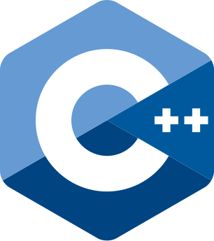
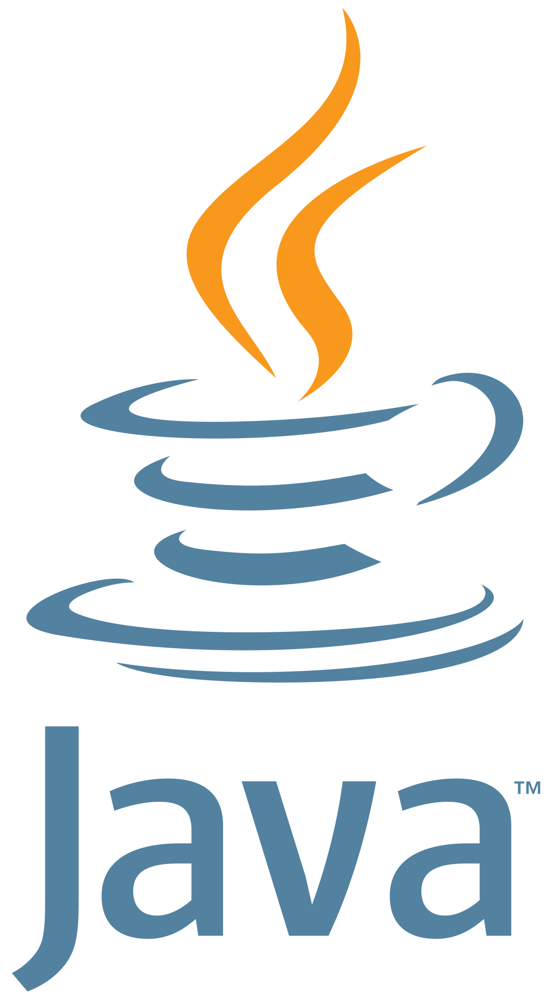

<div>
    <h1 align="left"></h1>
</div>

TidesDB is a fast and efficient key value storage engine library written in C.
The underlying data structure is based on a log-structured merge-tree (LSM-tree).

It is not a full-featured database, but rather a library that can be used to build a database atop of or used as a standalone key-value/column store.

[](https://github.com/tidesdb/tidesdb/actions/workflows/build_and_test_tidesdb.yml)

> [!CAUTION]
> master is in active development.  TidesDB 1 is the projected stable first MAJOR release.  We are in the beta development stages.

## Features
- [x] **ACID** transactions are atomic, consistent, isolated, and durable.  Transactions are tied to their respective column family.
- [x] **Concurrent** multiple threads can read and write to the storage engine. Column families use a read-write lock thus allowing multiple readers and a single writer per column family.  Transactions on commit and rollback block other threads from reading or writing to the column family until the transaction is completed.  A transaction in itself is also is thread safe.
- [x] **Column Families** store data in separate key-value stores.  Each column family has their own memtable and sstables.
- [x] **Atomic Transactions** commit or rollback multiple operations atomically.  When a transaction fails, it rolls back all commited operations.
- [x] **Cursor** iterate over key-value pairs forward and backward.
- [x] **WAL** write-ahead logging for durability. Column families replay WAL on startup.  This reconstructs memtable if the column family did not reach threshold prior to shutdown.
- [x] **Multithreaded Compaction** manual multi-threaded paired and merged compaction of sstables.  When run for example 10 sstables compacts into 5 as their paired and merged.  Each thread is responsible for one pair - you can set the number of threads to use for compaction.
- [x] **Background Partial Merge Compaction** background partial merge compaction can be started.  If started the system will incrementally merge sstables in the background from oldest to newest once column family sstables have reached a specific provided limit.  Merges are done every n seconds. Merges are not done in parallel but incrementally.
- [x] **Bloom Filters** reduce disk reads by reading initial blocks of sstables to check key existence.
- [x] **Compression** compression is achieved with Snappy, or LZ4, or ZSTD.  SStable entries can be compressed as well as WAL entries.
- [x] **TTL** time-to-live for key-value pairs.
- [x] **Configurable** column families are configurable with memtable flush threshold, data structure, if skip list max level, if skip list probability, compression, and bloom filters.
- [x] **Error Handling** API functions return an error code and message.
- [x] **Easy API** simple and easy to use api.
- [x] **Multiple Memtable Data Structures** memtable can be a skip list or hash table.
- [x] **Multiplatform** Linux, MacOS, and Windows support.
- [x] **Logging** system logs debug messages to log file.  This can be disabled.  Log file is created in the database directory.
- [x] **Block Indices** by default `TDB_BLOCK_INDICES` is set to 1.  This means TidesDB for each column family sstable there is a last block containing a sorted binary hash array.  This compact data structure gives us the ability to retrieve the specific offset for a key and seek to its containing key value pair block within an sstable without having to scan an entire sstable.  If `TDB_BLOCK_INDICES` is set to 0 then block indices aren't used nor created and reads are slower and consume more IO and CPU having to scan and compare.

## Building
Using cmake to build the shared library.
```bash
cmake -S . -B build
cmake --build build
cmake --install build
```

## Requirements
You need cmake and a C compiler.
You also require the `snappy`, `lz4`, and `zstd` libraries.
### Linux
```bash
sudo apt install libzstd-dev
sudo apt install liblz4-dev
sudo apt install libsnappy-dev
```

### MacOS
```bash
brew install zstd
brew install lz4
brew install snappy
```

### Windows
Windows using vcpkg
```bash
vcpkg install zstd
vcpkg install lz4
vcpkg install snappy
```

## Bindings
Bindings are in the works in various languages.
<ul>
    <li> <a href="https://github.com/tidesdb/tidesdb-cpp">tidesdb-cpp</a></li>
    <li> <a href="https://github.com/tidesdb/tidesdb-go">tidesdb-go</a></li>
    <li> <a href="https://github.com/tidesdb/tidesdb-java">tidesdb-java</a></li>
    <li> <a href="https://github.com/tidesdb/tidesdb-python">tidesdb-python</a></li>
    <li> <a href="https://github.com/tidesdb/tidesdb-rust">tidesdb-rust</a></li>
    <li> <a href="https://github.com/tidesdb/tidesdb-lua">tidesdb-lua</a></li>
    <li><a href="https://github.com/tidesdb/tidesdb-csharp">tidesdb-csharp</a></li>
    <li><a href="https://github.com/tidesdb/tidesdb-scala">tidesdb-scala</a></li>
    <li><a href="https://github.com/tidesdb/tidesdb-objective-c">tidesdb-objective-c</a></li>
    <li><a href="https://github.com/tidesdb/tidesdb-php">tidesdb-php</a></li>
    <li><a href="https://github.com/tidesdb/tidesdb-perl">tidesdb-perl</a></li>
    <li><a href="https://github.com/tidesdb/tidesdb-ruby">tidesdb-ruby</a></li>
    <li><a href="https://github.com/tidesdb/tidesdb-swift">tidesdb-swift</a></li>
    <li><a href="https://github.com/tidesdb/tidesdb-haskell">tidesdb-haskell</a></li>
    <li><a href="https://github.com/tidesdb/tidesdb-d">tidesdb-d</a></li>
    <li><a href="https://github.com/tidesdb/tidesdb-kotlin">tidesdb-kotlin</a></li>
    <li><a href="https://github.com/tidesdb/tidesdb-julia">tidesdb-julia</a></li>
    <li><a href="https://github.com/tidesdb/tidesdb-r">tidesdb-r</a></li>
    <li><a href="https://github.com/tidesdb/tidesdb-js">tidesdb-js</a></li>
    <li><a href="https://github.com/tidesdb/tidesdb-dart">tidesdb-dart</a></li>
    <li><a href="https://github.com/tidesdb/tidesdb-nim">tidesdb-nim</a></li>
    <li><a href="https://github.com/tidesdb/tidesdb-zig">tidesdb-zig</a></li>
    <li><a href="https://github.com/tidesdb/tidesdb-ocaml">tidesdb-ocaml</a></li>
    <li><a href="https://github.com/tidesdb/tidesdb-fsharp">tidesdb-fsharp</a></li>
    <li><a href="https://github.com/tidesdb/tidesdb-erlang">tidesdb-erlang</a></li>
    <li><a href="https://github.com/tidesdb/tidesdb-elixir">tidesdb-elixir</a></li>

</ul>

## Discord Community
Join the [TidesDB Discord Community](https://discord.gg/8eJmWtec) to ask questions, work on development, and discuss the future of TidesDB.

## Dependencies
- [Snappy](https://github.com/google/snappy)
- [LZ4](https://github.com/lz4/lz4)
- [Zstandard](https://github.com/facebook/zstd)

## Include
```c
#include <tidesdb.h>
```

## Usage
Each database method returns a `tidesdb_err_t*` which returns an error code and message. If no error, TidesDB returns `NULL`.

**Example of error structure**
```c
typedef struct
{
    int code;
    char *message;
} tidesdb_err_t;
```

### Opening a database
To open a database you pass the path to the database directory and a pointer to the database.
```c

tidesdb_t *tdb = NULL;
tidesdb_err_t *e = tidesdb_open("your_tdb_directory", &tdb);
if (e != NULL)
{
    /* handle error */
    tidesdb_err_free(e);
}

/* close the database */
e = tidesdb_close(tdb);
if (e != NULL)
{
    /* handle error */
    tidesdb_err_free(e);
}

```

### Creating a column family
In order to store data in TidesDB you need a column family.  This is by design.

**You pass**
- the database you want to create the column family in.  Must be open
- the name of the column family
- memtable flush threshold in bytes.  Example below is 128MB
- skip list max level.  Example below is 12 ( only if using `TDB_MEMTABLE_SKIP_LIST` ) pass `TDB_USING_HT_MAX_LEVEL` if using `TDB_MEMTABLE_HASH_TABLE`
- skip list probability.  Example below is 0.24 ( only if using `TDB_MEMTABLE_SKIP_LIST` ) pass `TDB_USING_HT_PROBABILITY` if using `TDB_MEMTABLE_HASH_TABLE`
- whether column family sstable data is compressed
- the compression algorithm to use [`TDB_NO_COMPRESSION`, `TDB_COMPRESS_SNAPPY`, `TDB_COMPRESS_LZ4`, `TDB_COMPRESS_ZSTD`]
- whether to use bloom filters
- what data structure to use for the memtable [`TDB_MEMTABLE_SKIP_LIST`, `TDB_MEMTABLE_HASH_TABLE`]

```c
/* create a column family with no compression and no bloom filters (slower reads) */
tidesdb_err_t *e = tidesdb_create_column_family(tdb, "your_column_family", (1024 * 1024) * 128, 12, 0.24f, false, TDB_NO_COMPRESSION, false, TDB_MEMTABLE_SKIP_LIST);
if (e != NULL)
{
    /* handle error */
    tidesdb_err_free(e);
}
```

Using Snappy compression, bloom filters and hash table memtable.
```c
/* create a column family with compression and bloom filter (the bloom filter provides fast read speed) */
tidesdb_err_t *e = tidesdb_create_column_family(tdb, "your_column_family", (1024 * 1024) * 128, TDB_USING_HT_MAX_LEVEL, TDB_USING_HT_PROBABILITY, true, TDB_COMPRESS_SNAPPY, true, TDB_MEMTABLE_HASH_TABLE);
if (e != NULL)
{
    /* handle error */
    tidesdb_err_free(e);
}
```


### Dropping a column family

```c
/* drop a column family */
tidesdb_err_t *e = tidesdb_drop_column_family(tdb, "your_column_family");
if (e != NULL)
{
    /* handle error */
    tidesdb_err_free(e);
}
```

### Listing column families
You can list all column families in the database list as a string.  You must free the string when done.
```c
char *column_families = NULL;
tidesdb_err_t *err = tidesdb_list_column_families(tdb, &column_families);
if (err != NULL) {
/* handle error */
}

/* in this example we just print and free the column families */
printf("%s\n", column_families);
free(column_families);
```


### Putting a key-value pair
You pass
- the database you want to put the key-value pair in.  Must be open
- the column family name you want to put the key-value pair in
- the key
- the key size
- the value
- the value size
- when the key-value pair should expire.  If -1 then it never expires.

```c
/* put a key-value pair */
uint8_t key[] = "key";
uint8_t value[] = "value";

tidesdb_err_t *e = tidesdb_put(tdb, "your_column_family", key, sizeof(key), value, sizeof(value), -1);
if (e != NULL)
{
    /* handle error */
    tidesdb_err_free(e);
}
```

### Putting a key-value pair with TTL
```c
/* put a key-value pair with TTL */
uint8_t key[] = "key";
uint8_t value[] = "value";

time_t ttl = time(NULL) + 10; /* 10 seconds */
tidesdb_err_t *e  = tidesdb_put(tdb, "your_column_family", key, sizeof(key), value, sizeof(value), ttl);
if (e != NULL)
{
    /* handle error */
    tidesdb_err_free(e);
}
```

### Getting a key-value pair
You pass
- the database you want to get the key-value pair from.  Must be open
- the column family name
- the key
- the key size
- a pointer to the value
- a pointer to the value size
```c
size_t value_len = 0;
uint8_t *value_out = NULL;
uint8_t key[] = "key";

tidesdb_err_t *e = tidesdb_get(tdb, "your_column_family", key, sizeof(key), &value_out, &value_len);
if (e != NULL)
{
    /* handle error */
    tidesdb_err_free(e);
}
```

### Deleting a key-value pair
You pass
- the database you want to delete the key-value pair from.  Must be open
- the column family name
- the key
- the key size
```c
uint8_t key[] = "key";

tidesdb_err_t *e = tidesdb_delete(tdb, "your_column_family", key, sizeof(key));
if (e != NULL)
{
    /* handle error */
    tidesdb_err_free(e);
}
```

### Transactions
You can perform a series of operations atomically.  This will block other threads from reading or writing to the column family until the transaction is committed or rolled back.

You begin a transaction by calling `tidesdb_txn_begin`.

You pass
- the database you want to perform the operations in.  Must be open
- the transaction pointer
- the column family name you want to perform the operations in
```c
tidesdb_txn_t *transaction;
tidesdb_err_t *e = tidesdb_txn_begin(tdb, &transaction, "your_column_family");
if (e != NULL)
{
    /* handle error */
    tidesdb_err_free(e);
}
```

Now we can add operations to the transaction.
```c
const uint8_t key[] = "example_key";
const uint8_t value[] = "example_value";
tidesdb_err_t *e = tidesdb_txn_put(transaction, key, sizeof(key), value, sizeof(value), -1); /* you can pass a ttl, similar to put */
if (e != NULL)
{
    /* handle error */
    tidesdb_err_free(e);
}

/* you can add delete operations as well */
e = tidesdb_txn_delete(transaction, key, sizeof(key));
if (e != NULL)
{
    /* handle error */
    tidesdb_err_free(e);
}

/* now we commit */
e = tidesdb_txn_commit(transaction);
if (e != NULL)
{
    /* handle error */
    tidesdb_err_free(e);
}

/* before you free, you can rollback */
tidesdb_err_t *e = tidesdb_txn_rollback(transaction);
if (e != NULL)
{
    /* handle error */
    tidesdb_err_free(e);
}

/* free the transaction */
tidesdb_txn_free(transaction);
```

### Cursors
You can iterate over key-value pairs in a column family.
```c
tidesdb_cursor_t *c;
tidesdb_err_t *e = tidesdb_cursor_init(tdb, "your_column_family", &c);
if (e != NULL)
{
    /* handle error */
    tidesdb_err_free(e);
    return;
}

uint8_t *retrieved_key = NULL;
size_t key_size;
uint8_t *retrieved_value = NULL;
size_t value_size;

/* iterate forward */
while ((e = tidesdb_cursor_next(c)) == NULL)
{
    e = tidesdb_cursor_get(c, &retrieved_key, &key_size, &retrieved_value, &value_size);
    if (e != NULL)
    {
        /* handle error */
        tidesdb_err_free(e);
        break;
    }

    /* use retrieved_key and retrieved_value
     * .. */

    /* free the key and value */
    free(retrieved_key);
    free(retrieved_value);
}

if (e != NULL && e->code != TIDESDB_ERR_AT_END_OF_CURSOR)
{
    /* handle error */
    tidesdb_err_free(e);
}

/* iterate backward */
while ((e = tidesdb_cursor_prev(c)) == NULL)
{
    e = tidesdb_cursor_get(c, &retrieved_key, &key_size, &retrieved_value, &value_size);
    if (e != NULL)
    {
        /* handle error */
        tidesdb_err_free(e);
        break;
    }

    /* use retrieved_key and retrieved_value
     * .. */

    /* free the key and value */
    free(retrieved_key);
    free(retrieved_value);
}

if (e != NULL && e->code != TIDESDB_ERR_AT_START_OF_CURSOR)
{
    /* handle error */
    tidesdb_err_free(e);
}

tidesdb_cursor_free(c);

```

### Compaction
There are 2 ways to compact sstables.  Manual multi-threaded paired and merged compaction and automatic background partial merge compaction.
Compaction removes tombstones and expired keys if ttl is set.  Because merging merges and older and newer sstables only the newest version of key lives on.

#### Manual Multi-Threaded Parallel Compaction
You can manually compact sstables.  This method pairs and merges column family sstables from oldest to latest.  It will remove tombstones and expired keys if ttl is set.
Say you have 100, after compaction you will have 50; Always half the amount you had prior.  You can set the number of threads to use for compaction. Each thread handles 1 pair.

```c
tidesdb_err_t *e = tidesdb_compact_sstables(tdb, "your_column_family", 10); /* use 10 threads */
if (e != NULL)
{
    /* handle error */
    tidesdb_err_free(e);
}
```

#### Automatic / Background Partial Merge Compaction
You can start a background partial merge compaction.  This will incrementally merge sstables in the background from oldest to newest when minimum sstables are reached.  Merges are done every n seconds.  Merges are not done in parallel but incrementally.
You can set the minimum amount of column family sstables to trigger a background partial merge. Background merging blocks less than manual compaction.

You pass
- the database you want to start the background partial merge compaction in.  Must be open
- the column family name
- the number of seconds to wait before going to next pair and merging
- the minimum number of sstables to trigger a merge
```c
tidesdb_err_t *e = tidesdb_start_background_partial_merge(tdb, "your_column_family", 10, 10); /* merge a pair every 10 seconds and if there are a minimum 10 sstables */
```

### Column Family Statistics
You can get statistics on a column family.
#### Structs
```c
    typedef struct
    {
        tidesdb_column_family_config_t config;
        char *cf_name;
        int num_sstables;
        size_t memtable_size;
        size_t memtable_entries_count;
        bool partial_merging;
        tidesdb_column_family_sstable_stat_t **sstable_stats;
    } tidesdb_column_family_stat_t;

    typedef struct
    {
        char *sstable_path;
        size_t size;
        size_t num_blocks;
    } tidesdb_column_family_sstable_stat_t;

    typedef struct
    {
        char *name;
        int32_t flush_threshold;
        int32_t max_level;
        float probability;
        bool compressed;
        tidesdb_compression_algo_t compress_algo;
        tidesdb_memtable_ds_t memtable_ds;
        bool bloom_filter;
    } tidesdb_column_family_config_t;
```

#### Getting a column family stat
```c
tidesdb_column_family_stat_t *stat = NULL;
err = tidesdb_get_column_family_stat(tdb, "your_column_family", &stat);
if (err != NULL)
{
    /* handle error */
    tidesdb_err_free(e);
}
```

## License
Multiple

```
Mozilla Public License Version 2.0 (TidesDB)

-- AND --
BSD 3 Clause (Snappy)
BSD 2 (LZ4)
BSD 2 (xxHash - Yann Collet)
BSD (Zstandard)
```
